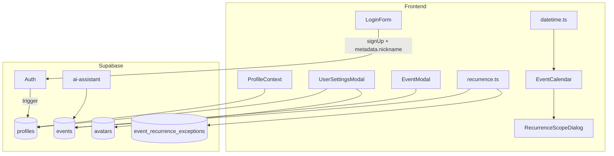

# 대규모 신규 기능 추가

React + Supabase 일정 관리 앱에 반복 일정, 사용자 프로필/개인설정, 다크모드, 타임존(UTC 저장 + 브라우저 로컬 표시), 회원가입 강화 기능을 추가한 변경 사항을 정리합니다.

> 초기 앱 구현 계획은 [PLAN.md](./PLAN.md)를 참고하세요.

---

## 목차

1. [기능 요약](#기능-요약)
2. [아키텍처](#아키텍처)
3. [데이터베이스 변경](#데이터베이스-변경)
4. [타임존 전략](#타임존-전략)
5. [반복 일정](#반복-일정)
6. [사용자 프로필 및 개인설정](#사용자-프로필-및-개인설정)
7. [회원가입 강화](#회원가입-강화)
8. [다크모드](#다크모드)
9. [AI 어시스턴트 연동](#ai-어시스턴트-연동)
10. [신규/수정 파일](#신규수정-파일)
11. [배포 및 마이그레이션](#배포-및-마이그레이션)

---

## 기능 요약

| 기능 | 설명 |
|------|------|
| **반복 일정** | 매일/매주/매월/매년 반복, 종료일·반복 횟수 지원, Google Calendar 수준 편집/삭제 범위 선택 |
| **사용자 프로필** | 닉네임, 프로필 이미지, `profiles` 테이블 + 가입 트리거 |
| **개인설정 Modal** | 프로필 이미지 업로드, 다크모드 토글 |
| **다크모드** | `profiles.theme` 저장, 로그인 시 `data-theme` 자동 적용 |
| **타임존** | DB는 진짜 UTC 저장, UI는 브라우저 로컬 타임존으로 표시/입력 (DB에 timezone 미저장) |
| **회원가입 강화** | 닉네임, 비밀번호 확인, 순차 검증, 비밀번호 강도 규칙 |

---

## 아키텍처



### Provider 계층

```
ErrorBoundary
  └─ QueryClientProvider
       └─ ToastProvider
            └─ AuthProvider
                 └─ ProfileProvider
                      └─ AuthGuard
                           └─ MainLayout
```

---

## 데이터베이스 변경

마이그레이션 파일: `supabase/migrations/003` ~ `006`

### 003 — profiles 테이블

```sql
profiles (
  id          uuid PK → auth.users(id)
  nickname    text NOT NULL
  avatar_url  text
  theme       text NOT NULL DEFAULT 'light'  -- 'light' | 'dark'
  created_at, updated_at
)
```

- RLS: 본인 프로필만 SELECT/INSERT/UPDATE
- `handle_new_user()` 트리거: 가입 시 `raw_user_meta_data.nickname`으로 프로필 자동 생성
- 기존 `auth.users` backfill 포함
- **timezone 컬럼 없음** (의도적 설계)

### 004 — avatars Storage

- 버킷 `avatars` (public read, 2MB 제한)
- 경로: `{user_id}/avatar.{ext}`
- RLS: 본인 폴더만 upload/update/delete

### 005 — 반복 일정 스키마

**events 테이블 추가 컬럼:**

| 컬럼 | 타입 | 설명 |
|------|------|------|
| `recurrence_freq` | text | `daily` / `weekly` / `monthly` / `yearly` / null |
| `recurrence_interval` | int | 간격 (기본 1) |
| `recurrence_count` | int | 최대 반복 횟수 (nullable) |
| `recurrence_until` | timestamptz | 종료일 (nullable) |

**event_recurrence_exceptions 테이블:**

| 컬럼 | 설명 |
|------|------|
| `event_id` | 마스터 이벤트 FK |
| `original_start_at` | 예외 대상 인스턴스 시작 시각 (UTC) |
| `type` | `modified` / `deleted` |
| `override_*` | 수정 시 덮어쓸 필드들 |

- Realtime publication에 `event_recurrence_exceptions` 추가

### 006 — UTC 데이터 마이그레이션

기존 데이터는 KST 벽시계가 `Z` 접미사로 저장되어 있었으므로, Asia/Seoul로 해석 후 진짜 UTC로 변환합니다.

> **주의:** 이 스크립트는 **기존 일정이 있을 때 1회만** 실행해야 합니다. 재실행 시 시간이 9시간 밀립니다.

---

## 타임존 전략

| 항목 | 방식 |
|------|------|
| DB 저장 | 일정 `start_at` / `end_at`만 진짜 UTC (`timestamptz`) |
| UI 표시 | DB UTC → 브라우저 로컬 타임존 변환 |
| UI 입력 | 사용자 로컬 벽시계 → UTC 변환 후 저장 |
| 설정 UI | 없음 (브라우저 `Intl` API 자동 감지) |
| AI 요청 | 프론트가 `getBrowserTimezone()`을 Edge Function에 전달 |

### 핵심 유틸 (`frontend/src/lib/datetime.ts`)

- `getBrowserTimezone()` — `Intl.DateTimeFormat().resolvedOptions().timeZone`
- `localToUtc()` / `utcToLocalFormInput()` — `date-fns-tz` 기반 변환
- `calendarRangeToUtcIso()` — FullCalendar 드래그/리사이즈 결과 변환
- 종일 일정: 날짜-only 의미 유지, FullCalendar exclusive end ↔ inclusive end 변환

### 이전 방식과의 차이

```
이전: KST 09:00 입력 → DB "2026-06-12T09:00:00.000Z" (가짜 UTC)
현재: KST 09:00 입력 → DB "2026-06-12T00:00:00.000Z" (진짜 UTC)
```

---

## 반복 일정

### 생성 (EventModal)

- 반복 없음 / 매일 / 매주 / 매월 / 매년
- 간격, 반복 횟수, 종료일 (둘 다 optional, 없으면 무한 반복)

### 표시 (recurrence.ts)

- 마스터 이벤트 + `event_recurrence_exceptions`를 기간 내에서 전개
- 각 인스턴스에 가상 ID: `{masterId}_{originalStartAt}`
- `deleted` 예외 → 인스턴스 제외, `modified` 예외 → override 적용

### 편집/삭제 범위 (RecurrenceScopeDialog)

| 범위 | 동작 |
|------|------|
| **이 일정만** | `event_recurrence_exceptions`에 레코드 INSERT |
| **이 일정 및 이후** | 마스터 `recurrence_until` 절단 + 새 마스터 생성 |
| **전체 반복 일정** | 마스터 UPDATE/DELETE + 예외 전체 삭제 |

드래그/리사이즈로 반복 인스턴스를 이동할 때도 동일한 범위 선택 Dialog가 표시됩니다.

### 관련 파일

- `frontend/src/lib/recurrence.ts` — 전개 엔진
- `frontend/src/lib/recurrenceActions.ts` — 범위별 edit/delete 분기
- `frontend/src/components/calendar/RecurrenceScopeDialog.tsx` — UI

---

## 사용자 프로필 및 개인설정

### 헤더 변경

- 기존: 이메일 + 이니셜
- 변경: **프로필 이미지 + 닉네임** (클릭 시 설정 Modal)

### 설정 Modal (UserSettingsModal)

1. **프로필 이미지** — Storage `avatars` 버킷 업로드
2. **다크모드** — 라이트/다크 토글 → `profiles.theme` 저장

> 타임존 설정 UI는 포함하지 않음 (브라우저 로컬 자동)

### ProfileContext

- 로그인 시 `profiles` 조회 (React Query `['profile', userId]`)
- `theme` 변경 시 `document.documentElement.dataset.theme` 즉시 반영

---

## 회원가입 강화

### 추가 필드

- 닉네임 (2~20자)
- 비밀번호 확인

### 비밀번호 규칙

- 8자 이상
- 특수문자 1개 이상
- Supabase `config.toml`: `minimum_password_length = 8`, `password_requirements = "lower_upper_letters_digits_symbols"`

### 검증 순서 (`frontend/src/lib/authValidation.ts`)

하나라도 실패하면 다음 단계로 진행하지 않음.

```
1. 이메일 형식 (+ 닉네임 길이)
2. 비밀번호 강도 (8자+, 특수문자)
3. 비밀번호 일치 여부
4. ID 중복 (signUp API 호출)
```

실패 시: 폼 하단 에러 메시지 + 토스트 **"회원가입에 실패했습니다."**

### signUp 연동

```typescript
supabase.auth.signUp({
  email,
  password,
  options: { data: { nickname } },
})
```

→ `handle_new_user()` 트리거가 `profiles` 행 생성

---

## 다크모드

### CSS (`frontend/src/index.css`)

- `:root` — 라이트 토큰 (기존)
- `[data-theme='dark']` — 다크 토큰 세트 (색상 1:1 대응)

### 적용 흐름

1. 로그인 → `ProfileContext`가 `profiles.theme` 로드
2. `document.documentElement.dataset.theme = 'light' | 'dark'`
3. `theme-color` 메타 태그 동적 갱신

---

## AI 어시스턴트 연동

### 변경 사항 (`supabase/functions/ai-assistant/tools.ts`)

- 타임스탬프: 사용자 로컬 벽시계 → UTC 변환 후 DB 저장
- `create_event`에 반복 파라미터 추가:
  - `recurrence_freq`, `recurrence_interval`, `recurrence_count`, `recurrence_until`
- 시스템 프롬프트: "KST 벽시계 저장" 문구 제거, UTC 저장 + 로컬 시간 입력 안내

### 프론트 요청 (`useAIChat.ts`)

```typescript
timezone: getBrowserTimezone()
```

---

## 신규/수정 파일

### 신규

| 경로 | 역할 |
|------|------|
| `supabase/migrations/003_create_profiles.sql` | profiles 테이블, 가입 트리거 |
| `supabase/migrations/004_create_avatars_storage.sql` | 아바타 Storage |
| `supabase/migrations/005_add_event_recurrence.sql` | 반복 일정 스키마 |
| `supabase/migrations/006_migrate_events_to_real_utc.sql` | UTC 데이터 마이그레이션 |
| `frontend/src/contexts/ProfileContext.tsx` | 프로필 Context |
| `frontend/src/hooks/useProfile.ts` | 프로필 CRUD 훅 |
| `frontend/src/lib/authValidation.ts` | 회원가입 검증 |
| `frontend/src/lib/recurrence.ts` | 반복 일정 전개 엔진 |
| `frontend/src/lib/recurrenceActions.ts` | 반복 일정 edit/delete 분기 |
| `frontend/src/components/settings/UserSettingsModal.tsx` | 개인설정 Modal |
| `frontend/src/components/calendar/RecurrenceScopeDialog.tsx` | 반복 범위 선택 Dialog |

### 주요 수정

| 경로 | 변경 |
|------|------|
| `frontend/src/lib/datetime.ts` | UTC ↔ 브라우저 로컬 변환 전면 리팩터 (`date-fns-tz`) |
| `frontend/src/types/index.ts` | `UserProfile`, `RecurrenceRule`, `ExpandedCalendarEvent` 등 |
| `frontend/src/components/auth/LoginForm.tsx` | 닉네임, PW 확인, 순차 검증 |
| `frontend/src/contexts/AuthContext.tsx` | `signUp(email, password, { nickname })` |
| `frontend/src/App.tsx` | ProfileProvider, 헤더 프로필 UI |
| `frontend/src/index.css` | 다크모드 토큰 |
| `frontend/src/components/calendar/EventModal.tsx` | 반복 UI, 로컬 타임존 라벨 |
| `frontend/src/components/calendar/EventCalendar.tsx` | 반복 인스턴스 편집/삭제, Scope Dialog |
| `frontend/src/hooks/useEvents.ts` | 반복 조회/전개, 범위별 CRUD |
| `frontend/src/lib/eventMapper.ts` | 전개 인스턴스 → FullCalendar 매핑 |
| `supabase/functions/ai-assistant/tools.ts` | UTC 변환, 반복 파라미터 |
| `supabase/config.toml` | 비밀번호 정책 강화 |

### 의존성 추가

- `date-fns-tz` (프론트엔드)

---

## 배포 및 마이그레이션

### CLI로 적용 (권장)

```bash
cd plan
supabase db push
npx supabase functions deploy ai-assistant
cd frontend && npm install && npm run dev
```

### 수동 적용 (SQL Editor)

002까지 적용된 상태에서:

1. `003_create_profiles.sql` 실행
2. `004_create_avatars_storage.sql` 실행
3. `005_add_event_recurrence.sql` 실행
4. `006_migrate_events_to_real_utc.sql` 실행 — **기존 일정 있을 때 1회만**

이후:

```bash
npx supabase functions deploy ai-assistant
cd frontend && npm install && npm run dev
```

### 체크리스트

- [ ] 마이그레이션 003~005 적용
- [ ] 006 적용 (기존 데이터 있을 때만, 1회)
- [ ] `ai-assistant` Edge Function 배포
- [ ] Edge Function Secrets (`GEMINI_API_KEY` 등) 설정
- [ ] `frontend/.env` — `VITE_SUPABASE_URL`, `VITE_SUPABASE_ANON_KEY`
- [ ] Supabase Dashboard Auth — 비밀번호 최소 8자 (클라우드 프로젝트)
- [ ] 기존 일정 시간이 올바르게 표시되는지 확인

### 주의사항

| 리스크 | 대응 |
|--------|------|
| 006 재실행 | 시간 9시간 어긋남 — 1회만 실행 |
| 수동 마이그레이션 후 `db push` | 이미 적용된 마이그레이션 중복 실행 가능 — `schema_migrations` 이력 확인 |
| 종일 일정 UTC 변환 | 날짜 경계 엣지 케이스 — 생성/표시 수동 테스트 권장 |

---

## 구현 Phase 요약

| Phase | 내용 | 상태 |
|-------|------|------|
| 0 | DB 마이그레이션 (profiles, storage, recurrence, UTC) | 완료 |
| 1 | 프로필, 회원가입 강화, 설정 Modal | 완료 |
| 2 | 다크모드 | 완료 |
| 3 | 타임존 리팩터 (UTC + 브라우저 로컬) | 완료 |
| 4 | 반복 일정 1단계 (생성/표시/시리즈 편집) | 완료 |
| 5 | 반복 일정 2단계 (이 일정만/이후/전체) | 완료 |
| 6 | AI 어시스턴트 연동 | 완료 |
