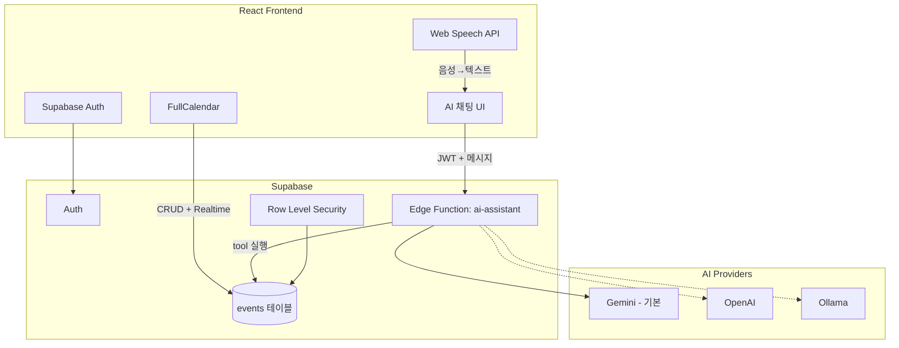
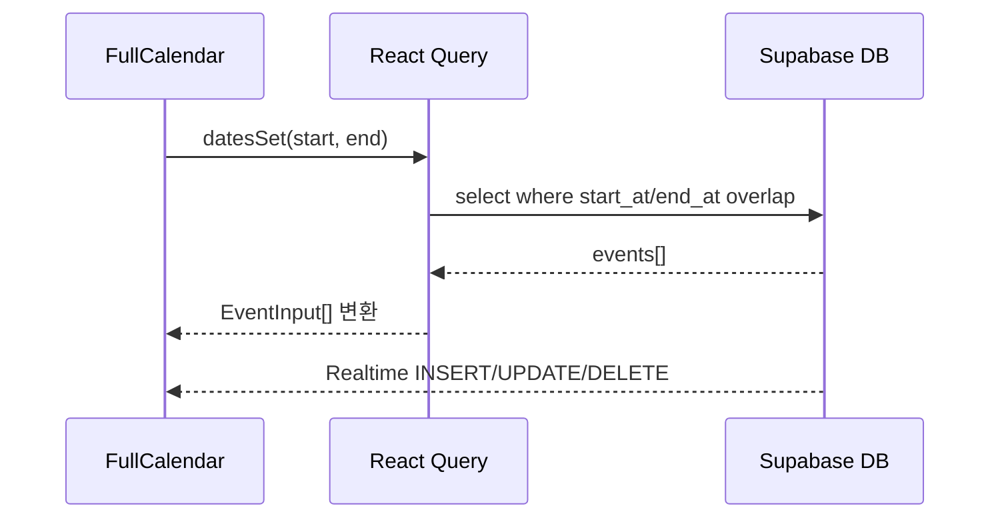
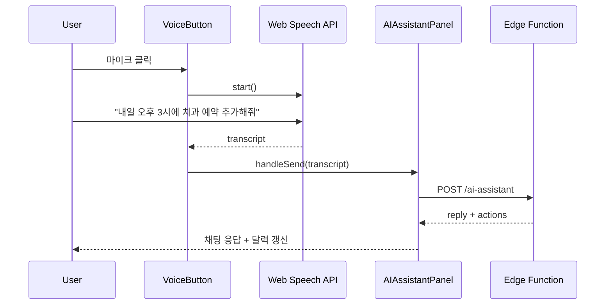

# 일정 관리 AI 앱 구현 계획

## 전체 아키텍처



---

## 1. 프로젝트 초기 설정

**프론트엔드**
- Vite + React + TypeScript로 [frontend/](frontend/) 생성
- 주요 패키지:
  - `@fullcalendar/react`, `@fullcalendar/daygrid`, `@fullcalendar/timegrid`, `@fullcalendar/interaction`, `@fullcalendar/list`
  - `@supabase/supabase-js`
  - `@tanstack/react-query` (서버 상태 캐싱)
  - `date-fns` (날짜 파싱/포맷)

**백엔드**
- Supabase CLI로 [supabase/](supabase/) 초기화
- 로컬 개발: `supabase start` + `supabase functions serve`

**환경 변수**
- 프론트: `VITE_SUPABASE_URL`, `VITE_SUPABASE_ANON_KEY`
- Edge Function: `GEMINI_API_KEY`, `OPENAI_API_KEY`(선택), `OLLAMA_BASE_URL`(선택), `AI_PROVIDER=gemini|openai|ollama`

---

## 2. 데이터베이스 및 인증 (Supabase)

### events 테이블

[supabase/migrations/001_create_events.sql](supabase/migrations/001_create_events.sql)

```sql
create table public.events (
  id          uuid primary key default gen_random_uuid(),
  user_id     uuid not null references auth.users(id) on delete cascade,
  title       text not null,
  description text,
  start_at    timestamptz not null,
  end_at      timestamptz not null,
  all_day     boolean not null default false,
  color       text,
  created_at  timestamptz not null default now(),
  updated_at  timestamptz not null default now()
);

create index events_user_start_idx on public.events (user_id, start_at);
```

### RLS 정책
- `SELECT/INSERT/UPDATE/DELETE` 모두 `auth.uid() = user_id` 조건
- AI Edge Function은 **사용자 JWT를 전달**받아 Supabase client를 user context로 생성 → RLS가 자동 적용되므로 다른 사용자 일정 접근 불가

### Auth
- 이메일/비밀번호 + Google OAuth(선택) 지원
- [frontend/src/lib/supabase.ts](frontend/src/lib/supabase.ts)에서 클라이언트 초기화
- [frontend/src/components/auth/AuthGuard.tsx](frontend/src/components/auth/AuthGuard.tsx)로 비로그인 사용자 차단

---

## 3. 달력 기능 (FullCalendar)

### 핵심 컴포넌트
- [frontend/src/components/calendar/EventCalendar.tsx](frontend/src/components/calendar/EventCalendar.tsx)

### 동작
| 기능 | 구현 |
|------|------|
| 월/주/일/목록 뷰 | dayGrid, timeGrid, list 플러그인 |
| 일정 표시 | `datesSet` 콜백에서 해당 기간 이벤트 Supabase 조회 |
| 드래그 생성 | `select` + `eventClick` + `eventDrop`/`eventResize` (interaction 플러그인) |
| 수동 CRUD | 이벤트 클릭 → 모달 폼 → Supabase insert/update/delete |
| 실시간 반영 | `supabase.channel('events').on('postgres_changes', ...)` 구독 |

### 데이터 흐름



### Supabase → FullCalendar 매핑
- `start_at` → `start`, `end_at` → `end`, `all_day` → `allDay`
- `extendedProps`에 `description`, `color` 저장

---

## 4. AI 일정 관리 (추가/수정/삭제/조회)

### 설계 원칙: Tool Calling 패턴
AI에게 자연어를 이해시키고, **구조화된 tool 호출**로 DB 작업을 실행합니다. Gemini/OpenAI/Ollama 모두 function/tool calling을 지원하므로 프로바이더 추상화가 가능합니다.

### AI Tools 정의

| Tool | 용도 | 파라미터 |
|------|------|----------|
| `create_event` | 일정 추가 | title, start_at, end_at, all_day?, description?, color? |
| `update_event` | 일정 수정 | id, 변경 필드들 |
| `delete_event` | 일정 삭제 | id |
| `query_events` | 일정 조회 | start_date?, end_date?, keyword?, limit? |

### Edge Function 구조

[supabase/functions/ai-assistant/index.ts](supabase/functions/ai-assistant/index.ts)

```
요청: { message, conversationHistory?, currentDate, timezone }
  ↓
1. JWT 검증 → user-scoped Supabase client 생성
2. AI Provider 선택 (env AI_PROVIDER)
3. System prompt + tools 전달
4. AI 응답의 tool_calls 실행 → DB CRUD
5. tool 결과를 AI에 재전달 (필요 시 multi-turn)
6. 응답: { reply, actions[], events[] }
```

### 프로바이더 추상화

[supabase/functions/ai-assistant/providers/](supabase/functions/ai-assistant/providers/)

```typescript
interface AIProvider {
  chat(params: {
    systemPrompt: string;
    messages: Message[];
    tools: ToolDefinition[];
  }): Promise<{ content: string; toolCalls: ToolCall[] }>;
}
```

- `gemini.ts` — `@google/generative-ai`, Gemini function calling (기본)
- `openai.ts` — OpenAI Chat Completions + tools
- `ollama.ts` — Ollama `/api/chat` + tools (로컬/자체 호스트 URL)

환경 변수 `AI_PROVIDER` 하나로 교체. 프론트 코드 변경 없음.

### System Prompt 핵심
- 현재 날짜/시간/타임존 컨텍스트 포함 ("내일", "다음 주 월요일" 해석)
- 모호한 요청 시 되묻기 (예: "회의 추가해줘" → 시간/제목 확인)
- 조회 결과는 자연어 요약 + `events` 배열 반환
- 삭제/수정 시 대상 일정이 여러 개면 확인 질문

### 프론트 AI UI
- [frontend/src/components/ai/AIAssistantPanel.tsx](frontend/src/components/ai/AIAssistantPanel.tsx)
  - 채팅 메시지 목록 + 입력창
  - AI 응답 후 React Query `invalidateQueries(['events'])` → 달력 자동 갱신
  - 조회 결과를 채팅 + 달력 하이라이트(선택)로 표시

---

## 5. 음성 기능 (2, 3번 AI 기능 연동)

### STT (Speech-to-Text)
- **Web Speech API** (`SpeechRecognition` / `webkitSpeechRecognition`) 사용
- 별도 API 비용 없음, Chrome/Edge에서 동작
- [frontend/src/hooks/useSpeechRecognition.ts](frontend/src/hooks/useSpeechRecognition.ts)

```typescript
// 흐름: 음성 → 텍스트 → AIAssistantPanel.handleSend(text)
recognition.lang = 'ko-KR';
recognition.onresult = (e) => setTranscript(e.results[0][0].transcript);
```

### UI
- [frontend/src/components/ai/VoiceButton.tsx](frontend/src/components/ai/VoiceButton.tsx)
  - 마이크 버튼: idle / listening / processing 상태
  - 인식 중 실시간 자막 표시
  - 인식 완료 → 자동으로 AI API 호출 (텍스트 입력과 동일 경로)

### TTS (선택, 1차 이후)
- `SpeechSynthesisUtterance`로 AI 응답 읽어주기 (브라우저 내장, 무료)
- "오늘 일정 3건입니다. 10시 팀 미팅..." 형태

### 음성 흐름



### 브라우저 호환성
- Chrome/Edge: 완전 지원
- Safari/Firefox: Web Speech API STT 미지원 → 텍스트 입력 fallback UI 표시
- 향후 Whisper API fallback은 Edge Function에 `transcribe` 엔드포인트 추가로 확장 가능

---

## 6. 디렉터리 구조

```
plan/
├── frontend/
│   ├── src/
│   │   ├── components/
│   │   │   ├── auth/          # Login, AuthGuard
│   │   │   ├── calendar/      # EventCalendar, EventModal
│   │   │   └── ai/            # AIAssistantPanel, VoiceButton, ChatMessage
│   │   ├── hooks/             # useEvents, useSpeechRecognition, useAIChat
│   │   ├── lib/               # supabase.ts, eventMapper.ts
│   │   ├── types/             # Event, ChatMessage, AIResponse
│   │   ├── App.tsx
│   │   └── main.tsx
│   ├── .env.example
│   └── package.json
├── supabase/
│   ├── migrations/
│   │   └── 001_create_events.sql
│   ├── functions/
│   │   └── ai-assistant/
│   │       ├── index.ts
│   │       ├── tools.ts       # tool 정의 + DB 실행
│   │       └── providers/
│   │           ├── index.ts   # factory
│   │           ├── gemini.ts
│   │           ├── openai.ts
│   │           └── ollama.ts
│   └── config.toml
└── README.md
```

---

## 7. 구현 단계 (권장 순서)

### Phase 1 — 기반 (1~2일)
- Vite React TS 프로젝트 생성
- Supabase 프로젝트 연결, Auth UI, events 마이그레이션 + RLS

### Phase 2 — 달력 (1~2일)
- FullCalendar 통합, 기간별 조회, 수동 CRUD 모달, Realtime 구독

### Phase 3 — AI (2~3일)
- Edge Function + Gemini provider + 4개 tool 구현
- AI 채팅 UI, 달력 연동(invalidateQueries)
- OpenAI/Ollama provider 스텁 추가 (인터페이스만, 구현은 동일 패턴)

### Phase 4 — 음성 (1일)
- useSpeechRecognition 훅 + VoiceButton
- AI 패널과 연결, fallback 처리

### Phase 5 — 마무리 (1일)
- 에러 처리, 로딩 상태, 반응형 레이아웃
- `.env.example`, README 작성

---

## 8. UI 레이아웃 제안

```
┌─────────────────────────────────────────────────┐
│  Header: 로고 | 사용자 메뉴(로그아웃)              │
├──────────────────────────┬──────────────────────┤
│                          │  AI Assistant        │
│   FullCalendar           │  ┌────────────────┐  │
│   (월/주/일 뷰)           │  │ 채팅 메시지     │  │
│                          │  │ ...            │  │
│                          │  └────────────────┘  │
│                          │  [🎤] [입력창] [전송] │
└──────────────────────────┴──────────────────────┘
```

- 데스크톱: 좌측 달력 70% + 우측 AI 패널 30%
- 모바일: 탭 전환 (달력 / AI)

---

## 9. 주요 기술 결정 요약

| 항목 | 선택 | 이유 |
|------|------|------|
| AI 실행 위치 | Supabase Edge Function | API 키 서버 보관, JWT 기반 RLS |
| AI 패턴 | Tool/Function calling | CRUD를 구조화해 hallucination 방지 |
| AI 기본값 | Gemini | 사용자 요청 |
| AI 확장 | Provider interface | OpenAI/Ollama env만 변경 |
| 음성 입력 | Web Speech API | 무료, latency 낮음, 텍스트 AI와 동일 경로 |
| 상태 관리 | React Query | 이벤트 캐싱 + AI 액션 후 invalidation |
| 실시간 | Supabase Realtime | AI/수동 CRUD 모두 달력 즉시 반영 |

---

## 10. 리스크 및 대응

- **Gemini 날짜 해석 오류** → system prompt에 `currentDate`, `timezone` 명시 + tool 실행 전 날짜 validation
- **동명/유사 일정 수정·삭제** → `query_events`로 후보 목록 조회 후 AI가 확인 질문
- **Web Speech API 미지원 브라우저** → 텍스트 입력 fallback + 안내 메시지
- **Ollama 로컬 사용** → Edge Function에서 `OLLAMA_BASE_URL`로 자체 서버 접근 필요 (Supabase Cloud Edge는 localhost 불가 → ngrok 또는 별도 VPS)
