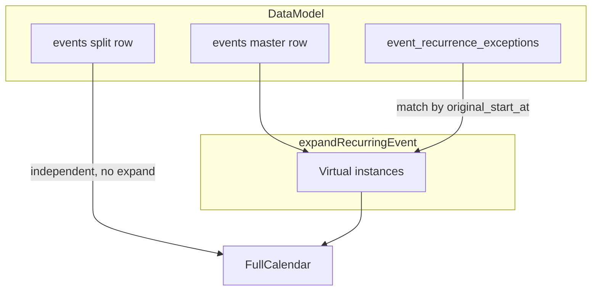
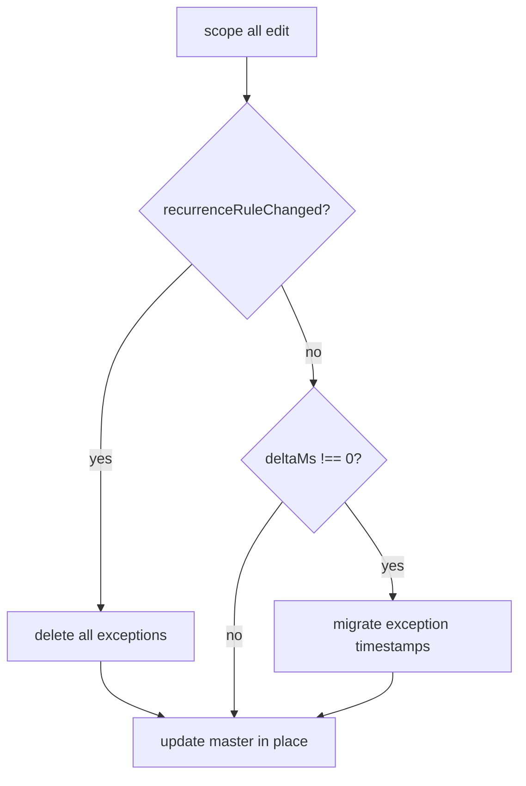

# 반복 일정 수정/삭제 정책 및 버그 수정 계획

> 관련 문서: [MAJOR_FEATURES.md](./MAJOR_FEATURES.md) · [PLAN.md](./PLAN.md)

---

## 배경

현재 반복 일정은 **마스터 1건(`events`) + 가상 회차 전개(`recurrence.ts`) + 예외(`event_recurrence_exceptions`)** 구조입니다.

**버그:** "이 일정만" 수정(split) 후 다른 회차에서 "전체 수정"(시간 이동)을 하면, `deleted` exception의 `original_start_at`이 마스터 anchor 이동과 함께 갱신되지 않아 해당 회차가 시리즈에 **재등장**합니다.

**원인 코드:** `frontend/src/lib/recurrenceActions.ts`의 `editRecurringEvent` `scope === 'all'` 분기가 마스터만 update하고 exceptions는 건드리지 않음.



---

## 정책 (공식)

### 수정

| 동작 | 처리 |
|------|------|
| **이 일정만 수정** | `event_recurrence_exceptions`에 `deleted` upsert + `events`에 단일 일정 insert (split) |
| **분리된 일정 수정** | 일반 일정과 동일 (`updateEvent` / `deleteEvent`) — 변경 없음 |
| **전체 수정 (규칙 변경 없음, 시간 이동)** | 마스터 update + **exceptions timestamp migrate** |
| **전체 수정 (제목/카테고리만)** | 마스터 update만 (`deltaMs === 0`) — 변경 없음 |
| **분리된 일정과 전체 수정** | split row는 독립이므로 제목/카테고리/날짜 변경 영향 없음 |

### 삭제

| 동작 | 처리 |
|------|------|
| **이 일정만 삭제** | `event_recurrence_exceptions`에 `deleted` upsert만 (미분리 회차는 `events` row 없음) — 변경 없음 |
| **전체 삭제** | exceptions 전 삭제 + 마스터 delete — 변경 없음 |

### 반복 규칙 변경

| 동작 | 처리 |
|------|------|
| **범위** | 무조건 **전체 수정** (인스턴스에서 규칙 변경 시 scope `'all'` 강제 또는 UI에서 규칙 변경 = 전체로 처리) |
| **저장 방식** | delete+recreate 아님 — 마스터 row **update in place** (UUID 유지) |
| **exceptions** | 규칙 변경 시 해당 `event_id`의 exceptions **전부 delete** (reset) |
| **split row** | `events`에 있는 분리 단일 일정은 **건드리지 않음** |

### 감수하는 edge case (구현하지 않음)

- split 후 반복 규칙 변경 → 같은 날짜에 split 일정 + 새 시리즈 회차 **중복 표시 가능**
- "이 일정만 삭제" 후 반복 규칙 변경 → 삭제했던 회차가 새 패턴에 **재등장 가능**
- daily/weekly/monthly/yearly × 무한/횟수/기한 조합에 대한 exception 이전/동기화는 **의도적으로 미구현**

---

## 구현 범위

### 1. 핵심: `frontend/src/lib/recurrenceActions.ts`

`editRecurringEvent`의 `scope === 'all'` 분기를 3갈래로 분리:

```text
allEdit:
  1. deltaMs, newStart, newEnd, payload 계산 (기존과 동일)
  2. recurrenceRuleChanged = master vs form.recurrence 필드 비교
     - freq, interval, count, until (정규화 후 비교)
  3. if recurrenceRuleChanged:
       - exceptions delete where event_id = master.id
     else if deltaMs !== 0:
       - fetchRecurrenceExceptions([master.id])
       - 각 exception: original_start_at (+ override_start_at/end_at) += deltaMs
       - unique (event_id, original_start_at) 충돌 방지: delete old row → insert new row
  4. master update (기존 payload)
```

**추가 헬퍼 함수** (같은 파일 또는 `frontend/src/lib/eventMapper.ts`):

- `recurrenceRuleChanged(master: CalendarEvent, form: EventFormData): boolean`
- `shiftTimestamp(iso: string, deltaMs: number): string`
- `migrateRecurrenceExceptions(eventId: string, deltaMs: number): Promise<void>`

**`scope === 'this'` / `deleteRecurringEvent`:** 현재 로직 유지 (이미 정책과 일치).

### 2. UI (선택, 최소 변경)

`frontend/src/components/calendar/EventCalendar.tsx` + `frontend/src/components/calendar/EventModal.tsx`:

- 인스턴스 편집(`isRecurringInstanceEdit`)에서 **반복 규칙 필드가 변경**된 경우:
  - scope dialog에서 `'all'`만 허용하거나
  - 저장 시 recurrence 변경 감지 → 자동 `'all'` 처리
- (선택) 규칙 변경 저장 시 confirm 1줄:
  - "반복 규칙을 변경하면 이전에 삭제·분리한 회차 설정이 초기화될 수 있습니다."

현재 인스턴스 편집 시 반복 UI가 열려 있으므로(`!isEditingRecurringMaster`), 규칙 변경 → 전체 처리 연결만 확인하면 됨.

### 3. 변경하지 않는 파일

- `frontend/src/lib/recurrence.ts` — 전개/exception 매칭 로직 그대로
- DB 마이그레이션 불필요
- AI assistant tools — 별도 scope 없음 (요청 시 별도 작업)

---

## 전체 수정 분기 플로우



---

## 테스트 시나리오 (수동)

1. **버그 fix (필수):** 매주 반복 → 2번째 "이 일정만" 수정 → 3번째 "전체" +1h → 2번째 회차 시리즈에 **재등장하지 않음**
2. **제목만 전체 수정:** split 후 다른 회차 제목만 변경 → split 일정 **변경 없음**, exception **유지**
3. **규칙 변경:** 매일 → 매월 "전체" → exceptions **삭제됨**, split row **유지**
4. **이 일정만 삭제:** exception만 추가, 마스터 **유지**
5. **전체 삭제:** 마스터 + exceptions **삭제**, split row **유지** (orphan 단일 일정)

---

## 구현 우선순위

1. `recurrenceRuleChanged` + `migrateRecurrenceExceptions` + `editRecurringEvent` all 분기 수정
2. (선택) UI confirm / recurrence 변경 시 all 강제

---

## 구현 체크리스트

- [x] `recurrenceRuleChanged` / `shiftTimestamp` 헬퍼 추가
- [x] `migrateRecurrenceExceptions` 구현: `deltaMs !== 0` 시 exception `original_start_at` (+ override) 이동
- [x] `editRecurringEvent` `scope=all` 분기: 규칙 변경 → exceptions wipe, 시간 이동 → migrate, 그 외 → master update only
- [x] 인스턴스 편집 시 반복 규칙 변경 → scope dialog 생략, `'all'` 자동 적용
